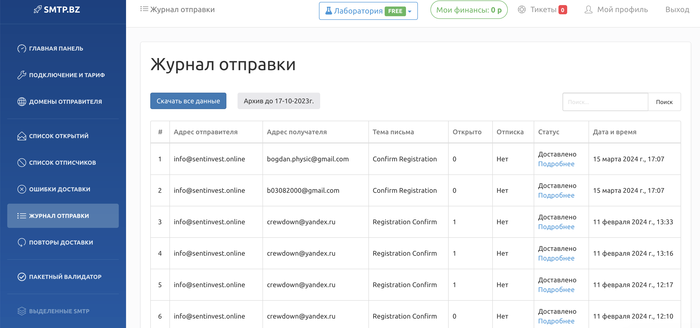
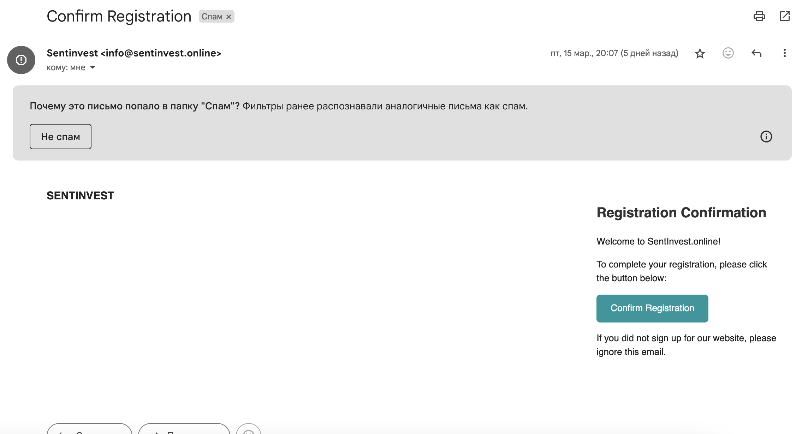

# Практика 5. Прикладной уровень

## Программирование сокетов.

### A. Почта и SMTP (7 баллов)

### 1. Почтовый клиент (2 балла)
Напишите программу для отправки электронной почты получателю, адрес
которого задается параметром. Адрес отправителя может быть постоянным. Программа
должна поддерживать два формата сообщений: **txt** и **html**. Используйте готовые
библиотеки для работы с почтой, т.е. в этом задании **не** предполагается общение с smtp
сервером через сокеты напрямую.

Приложите скриншоты полученных сообщений (для обоих форматов).

#### Демонстрация работы

```
@Service
class DefaultEmailService : EmailService {

    @Autowired
    private lateinit var mailSender: JavaMailSender
    override fun sendMail(mail: MailDTO): Boolean {
        try {
            val message = mailSender.createMimeMessage()
            val helper = MimeMessageHelper(message, true)

            helper.setTo(mail.recipient)
            helper.setSubject(mail.topic)
            helper.setText(mail.body)
            if (mail.attachment != null && mail.attachmentFile != null) {
                helper.addAttachment(mail.attachment!!, mail.attachmentFile!!)
            }

            mailSender.send(message)
            return true
        } catch (e: Exception) {
            e.printStackTrace()
        }

        return false
    }
}
```

Пример использования:

```
    @PutMapping("/public/change-password")
    fun RequestChangePassword(@RequestParam("mail") mail: String): HttpStatus {
        val user = userRepository.getUserByMail(Mail(mail))

        if (user == null) {
            return HttpStatus.OK
        }

        emailService.sendChangePasswordMail(user)
        return HttpStatus.OK
    }
```




### 2. SMTP-клиент (3 балла)
Разработайте простой почтовый клиент, который отправляет текстовые сообщения
электронной почты произвольному получателю. Программа должна соединиться с
почтовым сервером, используя протокол SMTP, и передать ему сообщение.
Не используйте встроенные методы для отправки почты, которые есть в большинстве
современных платформ. Вместо этого реализуйте свое решение на сокетах с передачей
сообщений почтовому серверу.

Сделайте скриншоты полученных сообщений.

#### Демонстрация работы
todo

### 3. SMTP-клиент: бинарные данные (2 балла)
Модифицируйте ваш SMTP-клиент из предыдущего задания так, чтобы теперь он мог
отправлять письма с изображениями (бинарными данными).

Сделайте скриншот, подтверждающий получение почтового сообщения с картинкой.

#### Демонстрация работы
todo

---

_Многие почтовые серверы используют ssl, что может вызвать трудности при работе с ними из
ваших приложений. Можете использовать для тестов smtp сервер СПбГУ: mail.spbu.ru, 25_

### Б. Удаленный запуск команд (3 балла)
Напишите программу для запуска команд (или приложений) на удаленном хосте с помощью TCP сокетов.

Например, вы можете с клиента дать команду серверу запустить приложение Калькулятор или
Paint (на стороне сервера). Или запустить консольное приложение/утилиту с указанными
параметрами. Однако запущенное приложение **должно** выводить какую-либо информацию на
консоль или передавать свой статус после запуска, который должен быть отправлен обратно
клиенту. Продемонстрируйте работу вашей программы, приложив скриншот.

Например, удаленно запускается команда `ping yandex.ru`. Результат этой команды (запущенной на
сервере) отправляется обратно клиенту.

#### Демонстрация работы

Сервер

```
import java.io.BufferedReader
import java.io.InputStreamReader
import java.io.PrintWriter
import java.net.ServerSocket
import java.net.Socket

fun main() {
    val port = 8080

    try {
        val serverSocket = ServerSocket(port)
        println("Сервер запущен...")

        while (true) {
            val clientSocket = serverSocket.accept()
            println("Новое соединение: $clientSocket")

            val clientHandler = ClientHandler(clientSocket)
            Thread(clientHandler).start()
        }
    } catch (e: Exception) {
        e.printStackTrace()
    }
}

class ClientHandler(private val clientSocket: Socket) : Runnable {
    override fun run() {
        try {
            val reader = BufferedReader(InputStreamReader(clientSocket.getInputStream()))
            val writer = PrintWriter(clientSocket.getOutputStream(), true)

            val command = reader.readLine()
            println("Принята команда от клиента: $command")

            val process = Runtime.getRuntime().exec(command)
            val processOutput = BufferedReader(InputStreamReader(process.inputStream))

            var line: String?
            while (processOutput.readLine().also { line = it } != null) {
                writer.println(line)
            }

            process.waitFor()
            reader.close()
            writer.close()
            clientSocket.close()
        } catch (e: Exception) {
            e.printStackTrace()
        }
    }
}
```

Клиент

```
import java.io.BufferedReader
import java.io.InputStreamReader
import java.io.PrintWriter
import java.net.Socket

fun main() {
    val serverAddress = "localhost"
    val serverPort = 8080

    try {
        val socket = Socket(serverAddress, serverPort)
        val reader = BufferedReader(InputStreamReader(System.`in`))
        val writer = PrintWriter(socket.getOutputStream(), true)
        val serverReader = BufferedReader(InputStreamReader(socket.getInputStream()))

        print("Введите команду для выполнения на сервере: ")
        val command = reader.readLine()

        writer.println(command)

        var line: String?
        while (serverReader.readLine().also { line = it } != null) {
            println("Результат выполнения команды: $line")
        }

        reader.close()
        writer.close()
        serverReader.close()
        socket.close()
    } catch (e: Exception) {
        e.printStackTrace()
    }
}

```


### В. Широковещательная рассылка через UDP (2 балла)
Реализуйте сервер (веб-службу) и клиента с использованием интерфейса Socket API, которая:
- работает по протоколу UDP
- каждую секунду рассылает широковещательно всем клиентам свое текущее время
- клиент службы выводит на консоль сообщаемое ему время

#### Демонстрация работы
todo

## Задачи

### Задача 1 (2 балла)
Рассмотрим короткую, $10$-метровую линию связи, по которой отправитель может передавать
данные со скоростью $150$ бит/с в обоих направлениях. Предположим, что пакеты, содержащие
данные, имеют размер $100000$ бит, а пакеты, содержащие только управляющую информацию
(например, флаг подтверждения или информацию рукопожатия) – $200$ бит. Предположим, что у
нас $10$ параллельных соединений, и каждому предоставлено $1/10$ полосы пропускания канала
связи. Также допустим, что используется протокол HTTP, и предположим, что каждый
загруженный объект имеет размер $100$ Кбит, и что исходный объект содержит $10$ ссылок на другие
объекты того же отправителя. Будем считать, что скорость распространения сигнала равна
скорости света ($300 \cdot 10^6$ м/с).
1. Вычислите общее время, необходимое для получения всех объектов при параллельных
непостоянных HTTP-соединениях
2. Вычислите общее время для постоянных HTTP-соединений. Ожидается ли существенное
преимущество по сравнению со случаем непостоянного соединения?

#### Решение
todo

### Задача 2 (3 балла)
Рассмотрим раздачу файла размером $F = 15$ Гбит $N$ пирам. Сервер имеет скорость отдачи $u_s = 30$
Мбит/с, а каждый узел имеет скорость загрузки $d_i = 2$ Мбит/с и скорость отдачи $u$. Для $N = 10$, $100$
и $1000$ и для $u = 300$ Кбит/с, $700$ Кбит/с и $2$ Мбит/с подготовьте график минимального времени
раздачи для всех сочетаний $N$ и $u$ для вариантов клиент-серверной и одноранговой раздачи.

#### Решение
todo

### Задача 3 (3 балла)
Рассмотрим клиент-серверную раздачу файла размером $F$ бит $N$ пирам, при которой сервер
способен отдавать одновременно данные множеству пиров – каждому с различной скоростью,
но общая скорость отдачи при этом не превышает значения $u_s$. Схема раздачи непрерывная.
1. Предположим, что $\dfrac{u_s}{N} \le d_{min}$.
   При какой схеме общее время раздачи будет составлять $\dfrac{N F}{u_s}$?
2. Предположим, что $\dfrac{u_s}{N} \ge d_{min}$. 
   При какой схеме общее время раздачи будет составлять  $\dfrac{F}{d_{min}}$?
3. Докажите, что минимальное время раздачи описывается формулой $\max\left(\dfrac{N F}{u_s}, \dfrac{F}{d_{min}}\right)$?

#### Решение
todo
